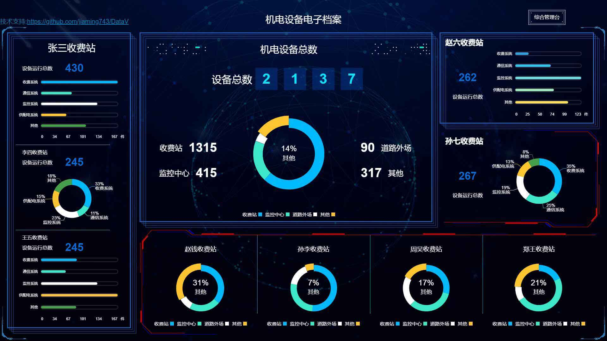

# @iimm/data-view-react

[](https://npmjs.com/package/@iimm/data-view-react)
[](https://npmjs.com/package/@iimm/data-view-react)

## 说明
**fork from [@jiaminghi/data-view-react](https://github.com/DataV-Team/DataV-React) 的1.2.5版本，**
**仅添加了类型，修改成了TypeScript版本,修改了下文件结构,基本未修改组件内容（调整了下格式）**

### npm 安装

```shell
$ npm install @iimm/data-view-react
```


## DataV-React 是干什么的?

- DataV-React 是一个基于**React**的数据可视化组件库(当然也有[Vue 版本](https://github.com/DataV-Team/DataV))
- 提供用于提升页面视觉效果的**SVG**边框和装饰
- 提供常用的**图表**如折线图等
- 飞线图/轮播表等其他组件

### 注意事项

**使用了 React Hooks, 简化了许多内部工作。您需要 React 版本 16.8.0 及以上**


### 使用
详细文档及示例请移步[HomePage](http://datav-react.jiaminghi.com).

### Demo

Demo 页面使用了全屏组件，请 F11 全屏后查看。

- [施工养护综合数据](http://datav-react.jiaminghi.com/demo/construction-data/index.html)


- [机电运维管理台](http://datav-react.jiaminghi.com/demo/manage-desk/index.html)


- [机电设备电子档案](http://datav-react.jiaminghi.com/demo/electronic-file/index.html)


